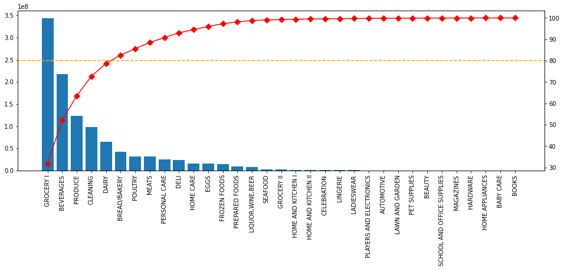
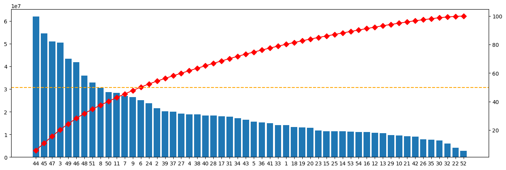

[Git repo](https://github.com/anpac20/sales_descriptive_analaysis)

## 1. Business Questions and Goals
In this project, I use real sales data from Favorita stores in Ecuador to explore how data analysis can support revenue growth. The main goal is to translate raw data into insights that answer actual business questions and help stakeholders make better decisions.

Key questions:

- Which product families generate the most revenue?
- Which stores account for most of the company’s revenue?
- Are promotions truly driving an increase in sales?
- Does the price of oil influence customer spending?
- Which product-store combinations are easy to forecast, and which are unpredictable?

## 2. Data
The dataset comes from a Kaggle competition and includes daily sales across multiple stores and product families, as well as data on oil prices. Since Ecuador is an oil-exporting country, its economy is sensitive to global oil prices, which may impact consumer behavior.

The main files used are:

- train.csv: Daily sales by store, product family, and promotion status.
- oil.csv: Daily oil prices (used as a proxy for macroeconomic health).

Dates range from 2013 to 2017. All analyses are done at a daily level.

## 3. Exploratory Analysis
This section explores sales distribution across stores and product families to identify concentration and revenue patterns.

Highlights:

- A small number of product families (e.g., GROCERY I, BEVERAGES, PRODUCE) generate the majority of sales.

- 13 stores drive over 50% of total revenue.

- A Pareto-like effect is clearly present, suggesting prioritization opportunities.

## 4. Promotion vs. Sales
Here, I examine the relationship between promotional activity and sales volume.

Findings:

- There is a moderate correlation between the number of promoted items and sales (r = 0.57) that suggests that promotions positively impact sales. 

[corr-total](images/corr-total.png)

- The effect varies across product families: in some categories, promotions strongly drive sales; in others, the impact is limited. The effect is stronger in categories like Beverages (0.60), supporting more targeted marketing strategies.

[corr-family](images/corr-family.png)

- Stores

[corr-store](images/corr-store.png)

## 5. Oil Prices vs. Sales: External Economic Influence
This section investigates whether sales patterns are influenced by oil prices.

Findings:

- There is a negative correlation between oil prices and sales (r ≈ -0.63).

- When oil prices drop, consumer spending seems to increase, possibly due to macroeconomic relief.

- For a business operating in an oil-dependent economy, this insight can support pricing and promotional strategies during periods of economic volatility.

## 6. Demand Profiles: Smooth, Erratic or Lumpy?
To assess forecastability, I calculate two key metrics:

ADI (Average Demand Interval): measures how frequently products are sold.

CV² (Coefficient of Variation squared): measures sales quantity variability.

Using these, I classify demand into:

- Smooth
- Intermittent
- Erratic
- Lumpy

Results:

- Most product-store combinations are classified as "Lumpy" or "Erratic", meaning their demand is hard to predict.

- Only ~27% of the combinations are "Smooth" and easy to forecast.

- This helps teams decide which products can be managed with automated forecasts and which need safety stock or special treatment.

## 7. Predictive Analysis

## 8. Recomendations

