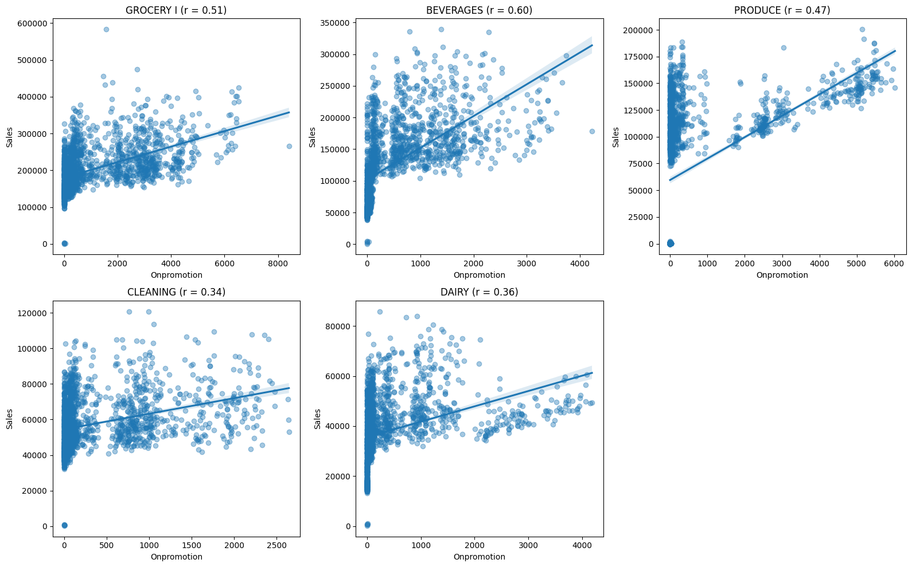

[Git repo](https://github.com/anpac20/sales_descriptive_analaysis)

## 1. Business hypothesis
In this project, I use real sales data from Favorita stores in Ecuador to explore how data analysis can support revenue growth. The main goal is to translate raw data into insights that answer actual business questions and help stakeholders make better decisions.

Key questions:

- Which product families generate the most revenue?
- Which stores account for most of the company’s revenue?
- Are promotions truly driving an increase in sales?
- Does the price of oil influence customer spending?
- Which product-store combinations are easy to forecast, and which are unpredictable?

## 2. Results and recomendations
### Focus on top-performing categories and stores
As seen in the exploratory analysis (Section 4), a small number of product families (e.g., GROCERY I, BEVERAGES, PRODUCE) and 13 stores account for 80% and 50% of total sales. Prioritizing these segments in inventory planning, forecasting, and campaign design can lead to more efficient resource allocation and higher return on effort.

### Deploy promotions selectively
Section 5 shows that promotional activity correlates moderately with sales overall (r = 0.57), but the impact is uneven across categories. BEVERAGES (r = 0.60) and GROCERY I (r = 0.51) respond well to discounts, while others like DAIRY and CLEANING show limited sensitivity. Promotional efforts should be targeted to high-response segments to maximize ROI.

### Adjust strategies based on macroeconomic indicators
Section 6 highlights a strong negative correlation between oil prices and sales (r ≈ -0.63). Sales in categories like PRODUCE and BEVERAGES appear especially sensitive to changes in oil prices. Monitoring external economic signals can help the business anticipate demand drops and adjust pricing, stock levels, or launch promotions during times of lower oil prices to stabilize revenue.

## 3. Data
The dataset comes from a Kaggle competition and includes daily sales across multiple stores and product families, as well as data on oil prices. Since Ecuador is an oil-exporting country, its economy is sensitive to global oil prices, which may impact consumer behavior.

The main files used are:

- train.csv: Daily sales by store, product family, and promotion status.
- oil.csv: Daily oil prices (used as a proxy for macroeconomic health).

Dates range from 2013 to 2017. All analyses are done at a daily level.

## 4. Exploratory Analysis
This section explores sales distribution across stores and product families to identify concentration and revenue patterns.

Highlights:

- A small number of product families (e.g., GROCERY I, BEVERAGES, PRODUCE) generate the majority of sales.

- 13 stores drive over 50% of total revenue.

- A Pareto-like effect is clearly present, suggesting prioritization opportunities.

## 5. Promotion vs. Sales
Here, I examine the relationship between promotional activity and sales volume.

Findings:

- There is a moderate correlation between the number of promoted items and sales (r = 0.57) that suggests that promotions positively impact sales. 

- The effect varies across product families: in some categories, promotions strongly drive sales; in others, the impact is limited. The effect is stronger in categories like Beverages (0.60), supporting more targeted marketing strategies.

- The same bevavior can be seen for stores:

## 6. Oil Prices vs. Sales: External Economic Influence
This section investigates whether sales patterns are influenced by oil prices.

Findings:

- There is a negative correlation between oil prices and sales (r ≈ -0.63).

- The correlation is higher for categories like PRODUCE (r = -0.65) and BEVERAGES (r = -0.63), suggesting that when oil prices drop, consumer spending seems to increase in these categories, possibly due to macroeconomic relief.

- For a business operating in an oil-dependent economy, this insight can support pricing and promotional strategies during periods of economic volatility.

